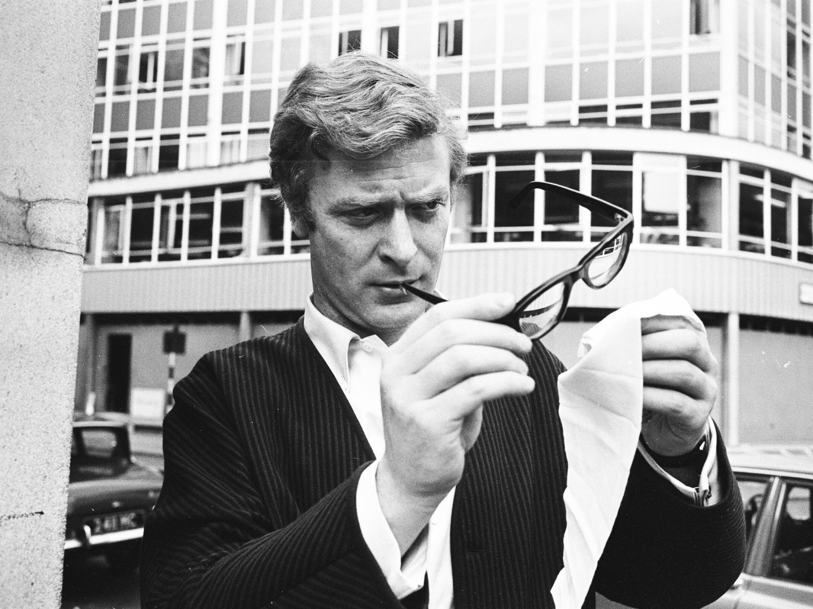
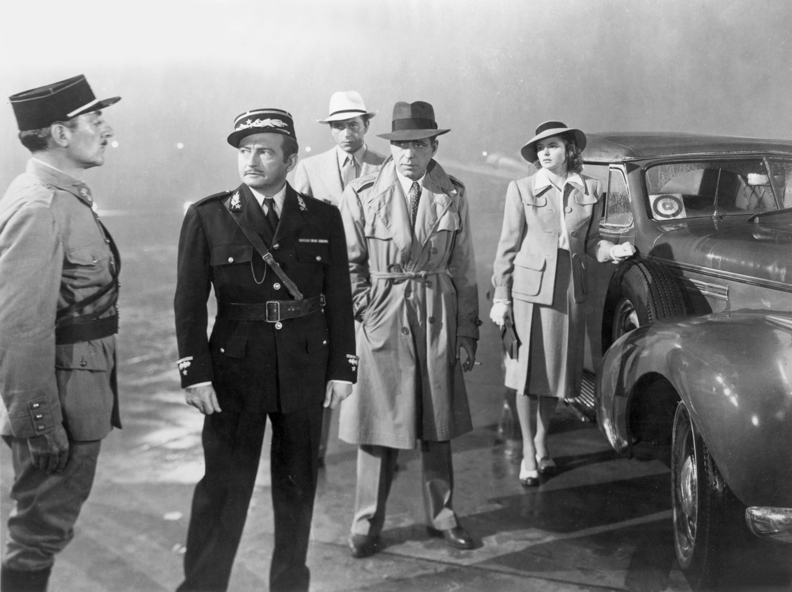
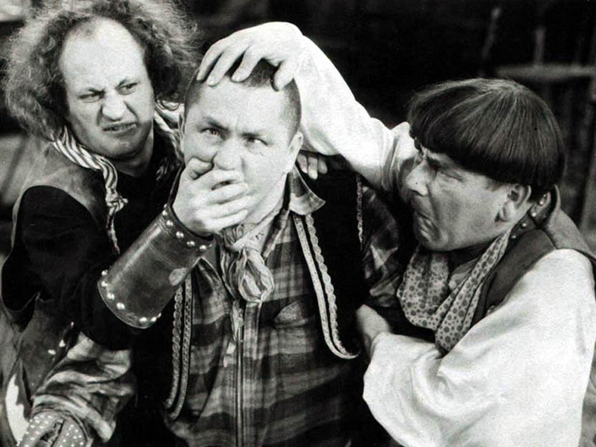

##Intro to Markdown
<br><br><br><br><br><br><br><br><br><br><br><br><br><br><br><br>
###Or Why I Should Stop Making Jokes On the Internet and Getting Myself Into These Situations

---


<br>
#What the Heck is Markdown?

Markdown is a way to write **plain text** files which can easily be **converted** into another format. Most often Markdown is converted to **HTML** to write web pages, but it's also possible to use it to create other formats such as PDF, RTF, LaTeX, and much more.


---
  

 
>Why should I care?

---


<br><br><br><br><br><br>

 * More visually pleasing than HTML
 * Easier to write with than HTML
 * Portable and flexible
 * More adoption

---


#Time to get our hands dirty.
<br><br><br><br><br><br>
http://daringfireball.net/projects/markdown/dingus

---

##Paragraphs and Line Breaks
<br><br><br><br><br>
`<p>` tags are automatically wrapped around paragraphs.

Use `<br />` or double spaces at the end of a line for a line break

---


<br>
##Headers
#`#`H1
##`##`H2
###`###`H3
####`####`H4

---
  
##Quotes

```
> Block each line
> in a paragraph.
```

<br><br><br>
> One morning I shot an elephant in my pajamas. 
> How he got in my pajamas, I don't know. 
--Groucho Marx


---
  
##Code Blocks

__Wrap code in \`\`\` three back ticks__

\`\`\`
`Code goes here`
\`\`\`

**Result**

```javascript
function isFighting(p1, p2) {
    if (p1.fighting == p2)
        return "Gentlemen, you can't fight in here! This is the War Room.";             
}
```

---
  
##Horizontal lines

```
* * *

***

*****

- - -

---------------------------------------

```

**Result**

You know what a line looks like.


---
  


<br><br><br>
##Emphasis

`Wrap your text with * or _`

Have you seen *Citizen Kane*?

---
  
##More Emphasis!!!!!

<br><br><br><br>
`Wrap your text with ** or __`

**Rosebud!!!**

---
  
##Adding Links
<br><br><br>
```
[You need this link](http://en.wikipedia.org/wiki/Chess)
```
[You need this link](http://en.wikipedia.org/wiki/Chess)

---
##Adding Images


Exactly the same as links but start with  
a "!"

```

```


---

  
##Inline Code

Wrap code in \` one back tick

<br>
```HAL's next command "`printf("What are you doing Dave?");`" was kinda creepy.```<br><br><br><br><br><br>
HAL's next command "`printf("What are you doing Dave?");`" was kinda creepy.

---


 

##Ordered Lists
Format: One space, number, a period, and a space

__Code__
`
 1. The Duke 
 1. Marion Mitchell Morrison
`

__Result__

 1. The Duke 
 1. Marion Mitchell Morrison


---
  
##Unordered Lists

Format: One space, an asterisk, a period, and a space
`
 * Why I oughta... 
 * Nyuk Nyuk Nyuk!
`
__Result__

 - Why I oughta... 
 - Nyuk Nyuk Nyuk!

---
  
 
##Nested Lists

Format: Use spaces to nest lists

__Code__
`
 * Characters
 	1. Sam Spade
	1. Ruth Wonderly
		* Joel Cairo
`

---
  
##Nested Lists cont.


__Result__

* Characters
	1. Sam Spade
	1. Ruth Wonderly
		* Joel Cairo

---


#Questions

---


